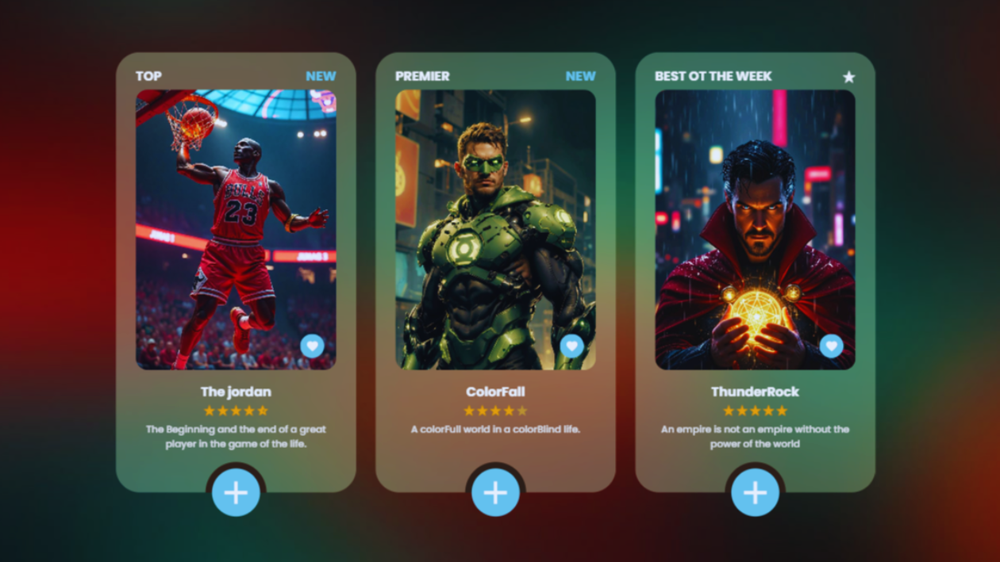

# 🎬 Movie Cards UI

A modern, beginner-friendly **Movie Cards UI** built with **HTML** and **CSS**.  
This project features a **glassmorphism effect**, **hover animations**, **responsive layout**, and **Material Icons integration** — perfect for practicing **front-end UI design** skills.


📺 Watch the full video tutorial on YouTube: [Watch Now](https://youtu.be/kxfiuv5R1xs)
---

## ✨ Features

- **Glassmorphism UI** for a sleek, modern look  
- **Material Icons** for intuitive visuals  
- **Responsive layout** that adapts to all devices  
- **Smooth hover animations** for interactive feedback  
- Beginner-friendly HTML & CSS structure  

---

## 📂 Project Structure

```plaintext
.
├── index.html     # Main HTML file
├── style.css      # Main CSS styles
└── img/           # Images used in the cards
```

---

## 🚀 Getting Started

1. **Clone this repository**  
   ```bash
   git clone https://github.com/aziz-chniti/movie-card.git
   ```

2. **Navigate to the project folder**  
   ```bash
   cd movie-card
   ```

3. **Open the HTML file in your browser**  
   ```bash
   open index.html
   ```
   *(Or simply double-click it)*

---

## 🖌️ Customization

- Replace images in the `img/` folder with your own movie posters.
- Edit text inside the `<h2>` and `<p>` tags for new titles and descriptions.
- Adjust colors and animations in `style.css` to fit your style.

---

## 🌐 Browser Compatibility

This project uses **CSS animations** and `backdrop-filter` for glassmorphism.  
For best results, view in modern browsers like **Chrome**, **Edge**, or **Safari**.  
If you want broader browser support:
- Use vendor prefixes for animations (e.g., `-webkit-`).
- Provide fallback background colors for older browsers.

---

## 💌 Contributing

Found an issue or want to improve the UI?  
Feel free to **fork the repo**, make your changes, and submit a pull request.

---

## 📚 Tutorial

This project was explained in detail on YouTube step by step.  
👉 **Link:** [Watch Now](https://youtu.be/kxfiuv5R1xs)
---
📘 **Get my Frontend Developement eBook:**
👉 https://barmajli.gumroad.com/l/iiflx

## 📬 Contact

Made with ❤️ by [Barmajli](https://www.youtube.com/@Barmajli)

📧 Reach out on Instagram: [@Barmajli](https://www.instagram.com/barmajli)
